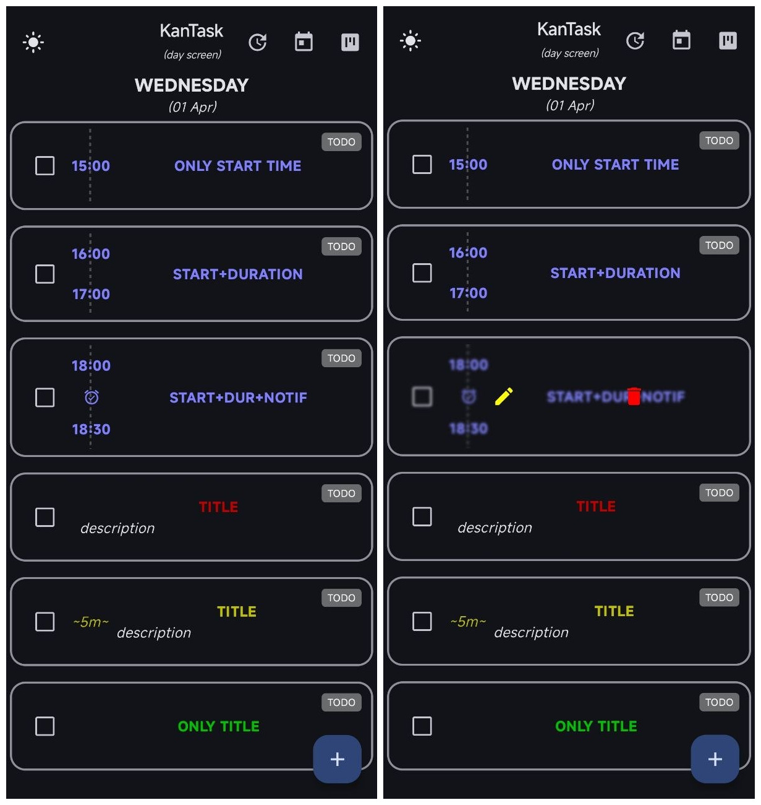
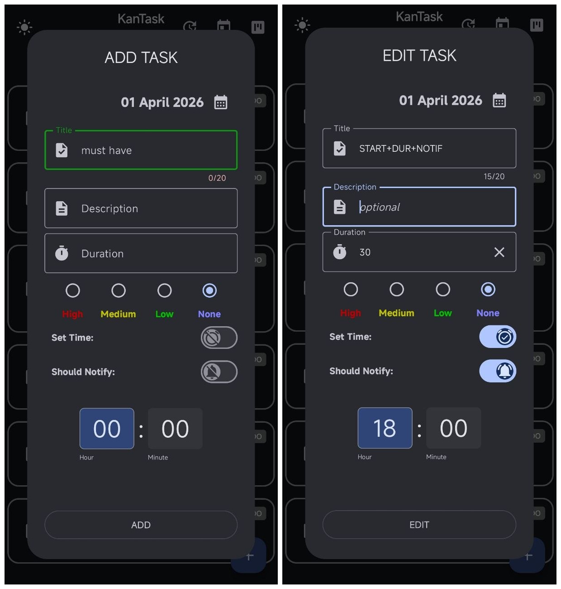
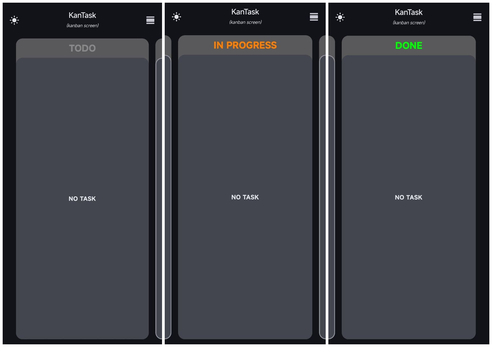
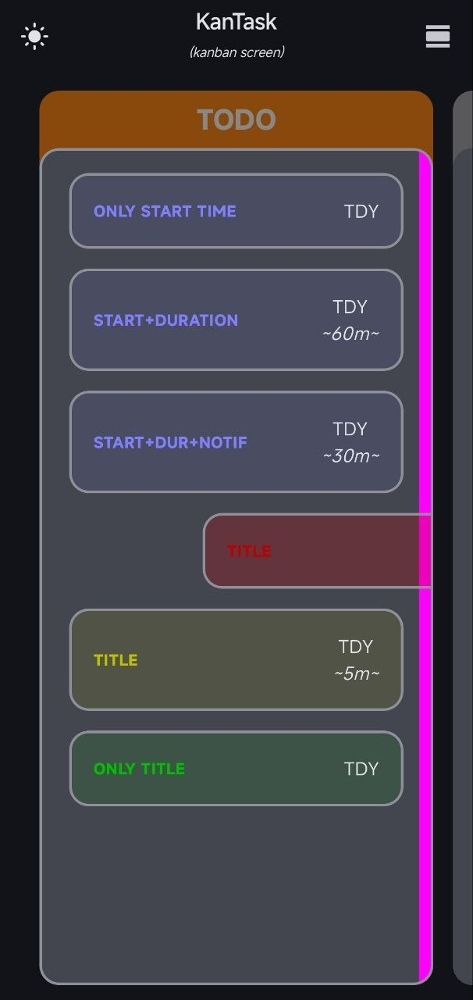
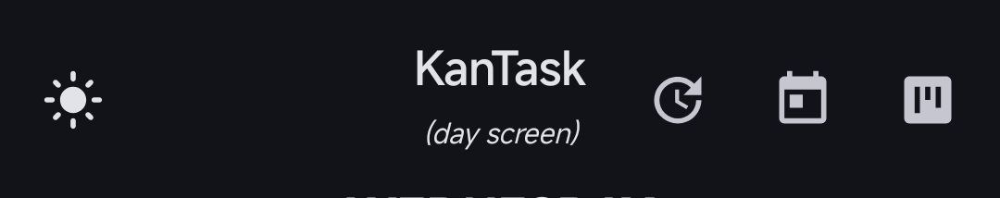

# KanTask - Task Management App

**KanTask** is a task management application that combines a classic daily to-do list with a functional Kanban board for tracking progress.

---

## 📱 Screenshots

### Day Management
Manage your tasks for the day and set up notifications in an intuitive interface.

<table width="100%">
  <tr>
    <th align="center" width="50%">DAY_SCREEN</th>
    <th align="center" width="50%">Add NEW Task OR Edit OLD Task</th>
  </tr>
  <tr>
    <td align="center">
      
    </td>
    <td align="center">
      
    </td>
  </tr>
</table>

### Kanban Board
Visualize your workflow and move tasks between stages.

<table width="100%">
  <tr>
    <th align="center" width="50%">TODO + IN PROGRESS + DONE</th>
    <th align="center" width="50%">Task Gestures</th>
  </tr>
  <tr>
    <td align="center">
      
    </td>
    <td align="center">
      
    </td>
  </tr>
</table>

### Navigation & UI
Quick access to the calendar, search and settings through the concise Topbar.

####Icon,Feature,Description
* ☀️- Theme - switching between light and dark design themes.
* 🕒 - Postpone - postpone all UNDONE task from past - to TODAY.
* 📅 - Scroll - jumps/scrolls from any day to TODAY.
* 📊 - Screen - switching between (Day Screen) and (Kanban Screen).

---

## 🛠 Features
* **Kanban Workflow**: Division of tasks into "Todo", "In Progress" and "Done".
* **Detailed Task Editor**: Time, importance and notification settings.
* **Adaptive UI**: Dark theme support and convenient navigation.
